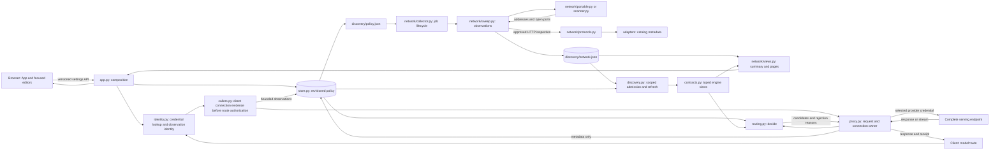
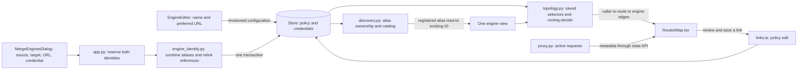

# Ownership and call flow

Operator policy, observed service catalogs, and caller identity are independent inputs to routing. `auto` is a route configuration record. Model IDs and endpoint hosts come from saved configuration and observed catalogs.

## Engine identity and the routing map

An engine ID identifies one complete API. `base_url` is its operator-selected request address; `aliases` contains its other known addresses. The UI prefers a configured DNS hostname for display and keeps the editable engine name separate. It does not perform reverse-DNS scans or infer identity from model names. An address registered to one engine cannot belong to another. Unknown duplicate addresses remain separate until the operator explicitly merges them.

Merge keeps the target engine's ID, name, type, model policy and limits. It unions addresses, rewrites explicit primary/backup and caller engine references, and keeps the chosen source/target credential (or none). Policy and credentials commit together; caches update after commit. A failed write rolls back both. Existing caller keys, access settings and request history keep their identities. An engine with active generations cannot merge; both identities reject new admission while the merge commits and refreshes. The operator waits for active work to finish before retrying. A stale revision fails without changing ownership.

Aliases are not automatic transport fallbacks. Requests use the preferred URL, and a catalog refresh follows that URL. Rediscovering a known alias returns its existing engine without an extra probe or row. The Network view remains an address/service inventory and associates every saved alias with that engine ID and name.

A caller permission policy is one existing record, named `Client` in the schema and `/clients` API for compatibility. Optional `kind` labels are shared, agent, machine and person. They describe the policy and do not grant access by themselves. A request can be observed before any policy exists. A key selects one policy and may be reused across callers.

`gateway/callers.py` records actual catalog and inference connections with direct peer address and port, normalized client library and version, optional runtime/OS/architecture hints, optional self-reported name, optional permission-policy ID and identity basis. The UI groups observations by direct source address and labels transport libraries separately from application names. API-key names come from the operator-assigned policy. Forwarding headers and reported names never grant authority. Console tests identify the console as the caller. `gateway/caller_records.py` defines observation identity from source, reported application name and normalized software. Changes to keys, permission policies, ports or numeric software versions refresh that observation. `gateway/store.py` consolidates older duplicate records transactionally, preserving first-seen time, request counts and a bounded recent-port list. The latest observation owns current authentication evidence. SQLite retains bounded connection metadata for seven days; neither prompts nor credentials enter it. Request history is preserved, including older events without source metadata.

Request history groups the loaded request records by direct source address. Source summaries show request and outcome counts; expanding a summary reveals the individual requests and their existing detail view. Filters and search act on requests before grouping. Grouping changes presentation only: each request keeps its ID, decision and outcome, and missing source evidence is labeled explicitly. Counts describe the loaded recent history, not a caller inventory or an all-time total.

The map has one source node per observed direct address, with routes and engines in the next columns. All observations from an address belong to that source, including connections using different policies or client libraries. Source selection reveals and focuses an inspector with application names, operating-system hints, library metadata and per-connection route decisions. A return control restores the graph. An address can represent several applications or devices; grouping never combines their permissions.

`gateway/topology.py` produces separate observation edges and saved-policy previews. Each observation uses its own authentication evidence and current effective policy with `routing.decide`. A saved policy without traffic can be configured in the map's Permission policies panel without creating a connected source. Selecting a policy previews its permissions and lets the operator review a route link. That edit applies to every connection using the policy.

The map evaluates text requests without capacity filtering. Green source edges mean every represented observation has an eligible text destination; amber means only some do. Engine highlighting applies the same per-observation check to that specific engine and primary or backup tier. Missing observation decisions stay unknown. Blue marks backup engine paths; dashed paths are unavailable or restricted. Tools, images and current capacity can further restrict an actual request. Request IDs are counted once on their recorded source-to-route hop and once on their route-to-engine hop. Policy previews do not carry traffic counts.

Select a source and a route to inspect access. Select a permission policy and a route, or a route and an engine, to review a configuration link. `src/map/links.ts` changes only the selected policy relation. Linking an engine pins that tier and explains the change from automatic selection before saving. Existing model/tag filters and caller permissions remain in effect. Pencil controls and the Details view open the precise policy forms.

## Source owners

| Source | Responsibility and decision |
|---|---|
| `gateway/schema.py` | Validates engines, routes, clients, discovery, access settings, account settings and account levels. The configuration has a schema version and revision. |
| `gateway/contracts.py` | Defines engine/model views, candidate decisions and rejections at JSON boundaries. |
| `gateway/engine_identity.py` | Validates explicit API merges and rewrites aliases and policy references without I/O. |
| `gateway/topology.py` | Evaluates each observed connection independently and exposes saved-policy previews separately from real source paths. Groups account callers by account with edges from the level-derived principal. |
| `gateway/store.py` | Owns SQLite transactions, cached policy reads, credential storage and metadata, including the account, account credential, account key, portal session, registered device and usage-window tables with their request-path caches. Refuses to remove a level that accounts still reference. Mutating request paths dispatch blocking storage work off the event loop. |
| `gateway/migration.py` | Preserves installed keys, access choices, observer contracts and scan policy during schema upgrades. Schema 5 adds account settings (disabled) and an empty level list. |
| `gateway/security/credentials.py` | Encrypts provider secrets and verifies operator/client keys. The encryption key lives outside the state directory. |
| `gateway/accounts/principal.py` | Projects an account and its level into the `Client` shape without I/O: `derive_principal` copies the level's permission fields, `current_principal` re-resolves that principal from current state. |
| `gateway/accounts/limits.py` | Admits account requests against the level's token budget and concurrency in one synchronous check-and-reserve after routing and before any upstream send; meters usage from engine reports or bounded size estimates, retaining counts only. |
| `gateway/accounts/api.py` | Operator endpoints for accounts, activation links, key revocation and usage summaries (admin router) and the account holder's portal endpoints (portal router), both included into the management API. Validates request shapes, maps store refusals to HTTP status, and shapes summaries and the portal's `me` document from ids, counts, the routing decision and the limits ledger, never from credentials. |
| `gateway/accounts/portal.py` | Owns portal sessions and the account holder's sign-in, activation, sign-out and password change. Reads only the `router_portal` cookie, requires a matching Origin for every write, bounds sign-in and the current-password check per source and per username, and verifies before answering so unknown, wrong and pending are one answer. Never grants operator authority. |
| `gateway/accounts/devices.py` | Pre-registered device addresses for the dev-mode path without I/O: validates one host literal, lists the enabled source policies a device address shadows, and produces the operator warnings that name them, only while both switches are on. |
| `gateway/callers.py` | Records bounded connection evidence before route authorization, including unassigned callers. Account callers carry account, key and device ids only; the router names them from the account, never from a header. |
| `gateway/caller_records.py` | Defines stable observation identity and metadata merging. Authentication is current evidence, never a caller fingerprint or a permission grant. |
| `gateway/identity.py` | Resolves bearer keys (client keys and `mru_` account keys), a pre-registered device at the direct peer address when both account switches are on, source/default policies, or a transient unkeyed observation identity. Identity never chooses a model. |
| `gateway/request_policy.py` | Selects the unkeyed source/default policy for both requests and the route map. |
| `gateway/security/limits.py`, `body_limit.py` | Bound login/registration attempts and management JSON before parsing. |
| `gateway/routing.py` | Pure policy evaluation: route/direct selection, allowlists, cloud permission, availability, capability requirements and ordering. |
| `gateway/proxy.py` | Rechecks current policy before every attempt (re-identifying account keys and devices against current account state, refusing a request whose account changed after admission), atomically claims capacity, owns the upstream connection, settles account admissions inside its single finish path, and records the result. |
| `gateway/stream_protocol.py` | Recognizes complete OpenAI SSE terminal events with bounded framing state, independently of HTTP connection closure. |
| `gateway/discovery.py` | Refreshes catalogs, expires observations, verifies registration scope and applies automatic admission. |
| `gateway/adapters/` | Catalog dialects and bounded HTTP metadata. Native enrichment preserves the OpenAI catalog's identity when both exist. |
| `gateway/network/collector.py` | Schedules identifiable jobs, accepts operator cancellation, and publishes failure/interruption status. |
| `gateway/network/sweep.py` | Combines TCP observations with explicit HTTP inspection policy. Refreshes known service metadata independently of long sweeps. |
| `gateway/network/portable.py` | Bounded TCP connect discovery across configured IPv4/IPv6 addresses and ports. Sends no application payload. |
| `gateway/network/scanner.py` | Optional Nmap process ownership, validated arguments, XML parsing and termination. |
| `gateway/network/local.py`, `announcements.py` | Optional local-socket and model-service announcement adapters. Missing permissions/dependencies stay visible. |
| `gateway/network/report.py` | Atomic policy, job request and report files. No credentials in this interface. |
| `gateway/network/views.py` | Small status summaries and paginated inventories, merged with fresh authenticated engine catalogs. |
| `gateway/app.py` | Constructs dependencies, owns HTTP routes and service lifetime, and serves built assets; `/portal` and `/portal/*` serve the same build so the page can choose the portal at load time (`src/main.tsx`). |
| `src/App.tsx`, `useRouterState.ts` | Navigation, action coordination and cancellable polling without overlapping scheduled requests. |
| `src/main.tsx` | Chooses the page by path at load time: `/portal` and `/portal/*` render `PortalApp`, everything else the console `App`. One build, one origin. |
| `src/portal/` | The account holder's page: `usePortalState` fetches only `/api/v1/portal/status` and `/me` (never operator state); a 401 signs out and a 403 re-reads the status so the disabled and suspended states come from the server's answer, not from parsing messages. Sign-in and activation (token from the address fragment, cleared after use), overview with route readiness and the usage meter, one-time key display with a paste-ready snippet, observed and — only while the switch is on — registered devices, password change and sign-out. Reuses the console's classes; `portal.css` styles the shell only. |
| `src/views/`, `EngineCard.tsx` | Focused activity, route, client, connection and request-detail views. |
| `src/editors/` | Separate engine, route, client and discovery editors with stale-draft checks. |
| `src/settings/AccessSettings.tsx` | Operator sign-in, optional default unkeyed policy and sessions. Route key gates live in the route editor. |
| `src/settings/SettingsSummary.tsx` | Explains saved access, scope, inspection and admission independently of form drafts. Canonical management address comes from server state. |
| `src/settings/AccountsSettings.tsx`, `AccountsTable.tsx`, `AccountDetail.tsx`, `CreateAccountDialog.tsx`, `ActivationDialog.tsx`, `DevicesTable.tsx`, `DeleteLevelDialog.tsx`, `UsageMeter.tsx` | Settings › Accounts: the two switches and session hours as a revisioned draft, the level list, and account, key and device management through the accounts API. Activation links are shown once and never re-read; usage is rendered from counts only. |
| `src/editors/LevelEditor.tsx` | Level permissions and limits in the caller-policy shape with stale-draft checks; a referenced level is removed only after its accounts are moved. |
| `src/useAccounts.ts` | Fetches account summaries outside the configuration revision and reloads them after every account action. |
| `src/caller-identity.tsx` | Presents connection evidence and uses the direct source as the fallback label when no application name is supplied. |
| `src/caller-sources.tsx` | Groups observations by direct address and exposes software and permission evidence in source details. |
| `src/views/request-history.ts`, `ActivityRail.tsx` | Groups loaded requests by direct source, summarizes outcomes, and preserves individual request inspection and filtering. |
| `src/map/source-topology.ts` | Projects per-observation decisions into ready, mixed, blocked or unknown source paths and attributes active requests by source. |
| `src/engine-addresses.ts` | Combines saved URLs and chooses a configured hostname for display. |
| `src/editors/MergeEnginesDialog.tsx` | Makes the surviving engine, preferred address and credential choice explicit. |
| `src/map/RoutesMap.tsx`, `links.ts` | Draws live policy relationships and active jobs; saves reviewed links through the configuration API. Account connections are grouped in a read-only Accounts tray and never resolved against permission policies. |
| `src/network/` | Evidence, search, paging, inspection status and job cancellation. |

## A request

On a pristine state, `Store` records that first-use setup is still required. The
management endpoints accept that first-use session only
when the TCP peer is not publicly routed; browser mutations still pass the
same-origin check. The first successful configuration save, valid bootstrap-key
login, or key rotation marks setup complete and establishes the ordinary browser
session, after which the saved operator authentication policy applies. Existing
databases are marked complete when the installation table is introduced, so an
upgrade never receives the fresh-install setup path.

`Identity.identify` resolves one configured client when a valid key or explicit source/default policy is present. An unusable authorization header receives an unassigned observation basis but the same source, default, or transient routing identity as a request without that header, so open routes remain compatible with clients that always send a placeholder key. A route marked `require_caller_key` still rejects it. Without a key and without a configured policy, the request receives the same transient observation identity and never creates a permission policy. `routing.route_requires_caller_key` then gates each requested route independently. `/v1/models` advertises only routes permitted by both the caller policy and that route gate.

An `mru_` account key takes a separate path. While user accounts are disabled the router refuses it before any lookup, so a disabled installation is neither an oracle for key validity nor a verification cost. Otherwise the key resolves to its account, the account to its level, and `gateway/accounts/principal.py` projects that level into a transient `Client` whose id is the account id: `decide` never learns that accounts exist, and a user key can never confer more than the level. The derived client is not in `config.clients`; `Proxy.dispatch` re-identifies the request before every attempt, so suspension, key revocation, a level change or turning accounts off applies between attempts exactly as a configured client's edits do. An invalid account key never falls through to a source, default or transient identity. Observed account callers are named from the account and key, carry only ids, and are grouped by account on the routing map; `/api/v1/explain` accepts an `account_id` so an operator can inspect the derived permissions. Console route tests never carry account state.

For a request without a usable key the identity order is fixed: (1) an `Authorization` header with a usable key selects that key's policy and never falls through; (2) when user accounts and device pre-registration are both on, a registered device at the direct peer address whose account is active, whose row is enabled and whose level exists receives that account's derived `Client` with the key marked present, so key-gated routes admit it; (3) the most specific enabled source policy (`allow_network_auth`) containing the address; (4) the default policy; (5) the transient unkeyed identity. A device is a single-host match, never less specific than an operator CIDR, so step 2 is the existing most-specific rule applied across record types; every failed device check falls through to step 3 rather than refusing. Unlike steps 3–5, step 2 does not demote its basis to `unassigned` when an unusable bearer was presented: the clients this mode exists for send a placeholder key header, and an `mru_` account key is resolved or refused in step 1 before the device is consulted. `gateway/accounts/devices.py` reports the source policies a device overrides, and `/api/v1/state` warns with each one, so the operator sees exactly which host the dev-mode path re-identifies. Only `request.client.host` participates; forwarding headers never do. The device path sets the same request state as an account key (with `device_id` in place of `key_id`), so admission and metering apply unchanged and observed callers are named from the account and device. The proxy's per-attempt re-identification runs the device step again before every upstream attempt, and `Proxy.dispatch` binds the account at admission: `identify` clears the account state before each identification, and when the re-identified account differs from the admitted one (a row disabled or the switch turned off, the address removed and re-registered to another account, or a host admitted without an account that became a device mid-request) the request is refused with 403 "Account access was removed" rather than continued under an admission it no longer owns or never passed. The device path therefore always carries the same admission as the account's keys.

For an account principal, `Proxy.dispatch` admits the request against its level's limits after `decide` has produced candidates and before any upstream send. `AccountLimits.admit` is one synchronous check-and-reserve: it refuses with 429 when the account's active requests have reached `max_concurrency`, or when tokens used plus tokens reserved in the current fixed window have reached the token budget; otherwise it reserves the estimated prompt plus completion size and claims a slot. The admission is held across every candidate attempt and through streaming. The existing `finish` is the single settle point and settles synchronously before it awaits persistence, so a cancellation can lose durability but never a slot or a reservation, and the crossing request is charged to the window it was admitted against. Streamed upstream requests for account principals carry `stream_options.include_usage`, and the resulting usage chunk is forwarded unchanged; when no report arrives the meter estimates from sizes without decoding content. Configured clients and unkeyed connections take none of these steps and record the same events as before.

The portal is the account holder's own surface and touches none of the above. `PortalIdentity` resolves the `router_portal` cookie to an account, refuses everything while user accounts are disabled before any lookup or rate-limit spend, and requires a matching Origin on every write. Activation consumes the one-time link in the same store transaction that writes the password; sign-in verifies a password before any account-specific answer; a password change or suspension revokes the account's other sessions. The portal's `me` document reuses `derive_principal` and `decide` so the routes it reports as ready are exactly those `/v1/models` lists for the same account. No portal endpoint reads or writes the configuration, so self-service never moves the operator's revision.

`decide` evaluates each current engine/model against the client's route, engine, model and cloud permissions. Route names take precedence over model IDs; the console warns when they collide. Raw model access requires explicit permission and an exact ID. Required capabilities and explicit unsupported options exclude candidates. Optional route defaults fill absent options and may be skipped where unsupported. A proven capability-only rejection yields HTTP 400 with `unsupported_capability`; potentially recoverable destinations keep the result HTTP 503. Public errors name only requirements from the request, while operator diagnostics retain engine and model details.

Name resolution distinguishes an unknown request target from a permission refusal. An absent route or model produces HTTP 404 with `model_not_found` and points the caller to `/v1/models`. A caller permitted to request model IDs retains a temporary-unavailability result when an eligible catalog is unavailable and absence cannot be established. Existing names still pass through route keys and caller permissions. The transport records HTTP 401 and 403 as `denied`, other request errors as `failed`, and temporary routing failures as `unavailable`. Historical receipts retain their original classification.

Primary candidates precede fallback candidates. Ordered routes follow the configured engine list. Least-busy routes compare this process's active requests to configured admission limits. Distributed engine members are descriptive membership, never independent failover candidates.

Before each attempt, `Proxy.dispatch` reads current policy and identity again. `InflightRequest.claim` checks and increments capacity synchronously, without yielding. Each endpoint/model pair is attempted once. The connection owner releases capacity after completion, cancellation or failure. Stream cancellation shields final metadata and upstream cleanup from Starlette's repeated cancellation at await points. Capacity is released after the connection closes, including when closure raises. This follows [AnyIO's finalization contract](https://anyio.readthedocs.io/en/stable/cancellation.html#finalization).

Selected transient failures can try another permitted candidate before any stream has been delivered. A 404 causes a catalog refresh; retry is justified only when that fresh catalog shows the requested model disappeared. Other 404 responses pass through. Once streaming begins, failure ends the stream with an error and never splices in a backup answer. A complete SSE `[DONE]` event records completion even when the client immediately closes the connection; an earlier disconnect remains cancellation. Final outcome persistence and connection cleanup are shielded together. Non-stream responses and management requests have size bounds. Cooldowns and upstream response limits are operator settings.

A completed request records `performance` for the attempt that served it, so an operator can compare engines and model replacements. `gateway/performance.py` keeps clock readings only: the upstream send, the first and last relayed stream chunk, or the end of a non-stream body. Each attempt restarts the clock, so time spent on a failed candidate never counts toward the engine that answered. `first_chunk_ms` is measured from the send to the first streamed chunk, which may carry only a role delta rather than a token. `tokens_per_second` divides completion tokens by the interval from the first to the last chunk and is recorded only for streams with more than one token. Completion tokens come from the upstream usage report when one arrives, otherwise from the relayed chunk count with `tokens_estimated: true`. The router never adds `stream_options` for this measurement; only account admission does. Failed, cancelled, denied and limited requests record no performance. No prompt or response content is read beyond what usage counting already inspects, and none is stored.

## Discovery and trust

The collector reads `policy.json` and writes `network.json` under the discovery directory. It never changes routes or credentials. The gateway reads observations, validates each advertised URL against current discovery scope, probes its catalog, and applies registration policy. A report-file entry alone cannot grant availability.

Open ports and HTTP inspection have separate policies. Complete TCP coverage can be enabled independently of inspection. HTTP requests go only to approved ports unless the operator enables broad inspection. Unknown, protected and non-chat services remain visible. Nmap port labels never prove a protocol. Router provenance uses the explicit catalog extension `model_serving: {version: 1, kind: "router"}`; owner names have no provenance authority. Undeclared relays cannot be proven to be backing engines, so automatic registration requires a trusted operator-selected scope.

Every job has an ID and a state. Overlapping Discover requests return the queued/running job rather than a false new success. Cancellation and policy changes end the current job. A new job rechecks its configured scope; there are no partial-report resume heuristics. Previous observations retain timestamps during a sweep. A filtered or silent address is inconclusive, not proof of absence.

The default worker runs inside the gateway using portable TCP connections. To run the optional external worker, set `MODEL_ROUTER_DISCOVERY_WORKER=external` on the gateway and launch `python -m gateway.network.collector --state <discovery-directory>` under the chosen service account. `MODEL_ROUTER_DISCOVERY_STATE` selects that directory. Only the optional Nmap SYN mode needs raw-packet capability. Give an external worker access to discovery files, not the router database or encryption key. Service management must ensure one worker owns this directory.

Registered catalogs refresh independently. Failed probes clear current models, stale observations become unroutable, and a generation check prevents an old response from overwriting a newer probe or edited endpoint. Invalid saved endpoints remain editable and fail only their own refresh; new or changed endpoints must have valid connection ports. Network views use authenticated registered observations when an anonymous inspection disagrees.

## Persistence and restart

SQLite owns durable configuration, credentials, sessions and request metadata. Configuration reads use a cached immutable copy. File and SQLite writes run outside the request event loop. Provider secrets are encrypted; operator/client verifiers are separately salted. Legacy client digests upgrade on successful use of the same key. Unused legacy keys remain valid until explicitly revoked.

Browser cookies contain random session tokens; only their hashes and expirations are persisted. Restart preserves sessions and settings while rebuilding catalog observations. Active generations and capacity counters belong to one process, so a restart interrupts those generations. Shared admission and high availability remain open work.
